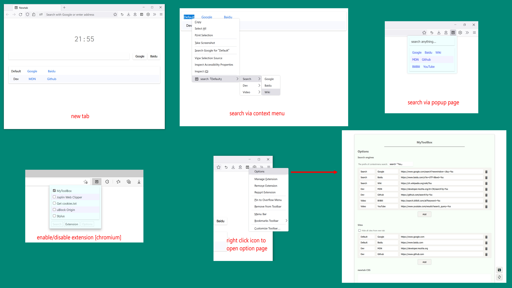

# My Tool Box

English / [中文](./README.zh.md)

## Features

1. search with specific engine from popup page.
2. search selected text with specific engine via context menu.
3. customize your newtab page with your favorite sites. (if you don't like it, you can change this in your browser setting)
4. customize your newtab page with your CSS code.
5. enable/disable your extension via popup page. (not support in firefox, see [Bug 1282982](https://bugzilla.mozilla.org/show_bug.cgi?id=1282982))

## screenshot

## Privacy Policy

1. *MyToolBox* is an non-profit opensource project. ([link](https://github.com/Landius/MyToolBox))
2. *MyToolBox* won't send any user data to any person or organization. All data are saved and synchronized via the extension API `chrome.storage.sync`.
3. *MyToolBox* needs permissions below to work:
    - `chrome_url_overrides`: customize your newtab page.
    - `storage`: save and sync user data.
    - `management`: enable/disable extensions.
    - `notification`: show notifications.
    - `contextMenus`: search selected text via context menu.
