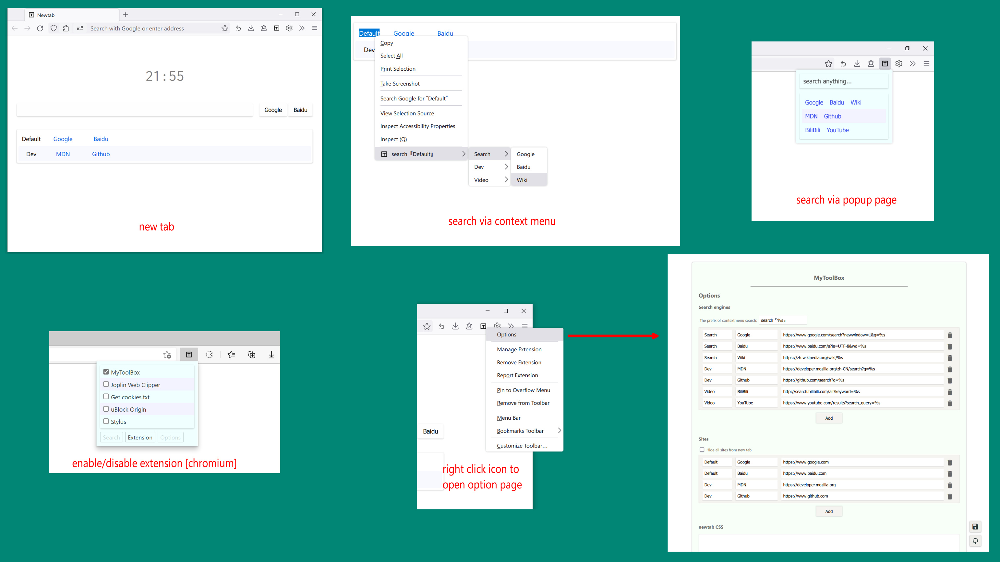

# My Tool Box

[English](./README.md) / 中文

## Feature

1. 通过弹窗选择特定的引擎进行搜索。
2. 选择网页文字时，通过右键菜单选择特定的引擎进行搜索。
3. 极简的可自定义网站的主页。（如不需要，可以在浏览器设置中更换）。
4. 主页样式可以在扩展设置中以 css 自定义。
5. 通过弹窗快速 启用/禁用 扩展 (firefox 无法使用此功能 [Bug 1282982](https://bugzilla.mozilla.org/show_bug.cgi?id=1282982))

## screenshot

## Privacy Policy

1. *MyToolBox* 是一个开源扩展 ([link](https://github.com/Landius/MyToolBox))
2. *MyToolBox* 不会发送任何用户数据给个人或组织，所有数据通过扩展 API `chrome.storage.sync` 进行存储和同步。
3. *MyToolBox* 需要以下权限:
    - `chrome_url_overrides`: 定制主页。
    - `storage`: 存储，同步数据。
    - `management`: 启用，禁用扩展。
    - `notification`: 显示通知。
    - `contextMenus`: 注册右键菜单。
